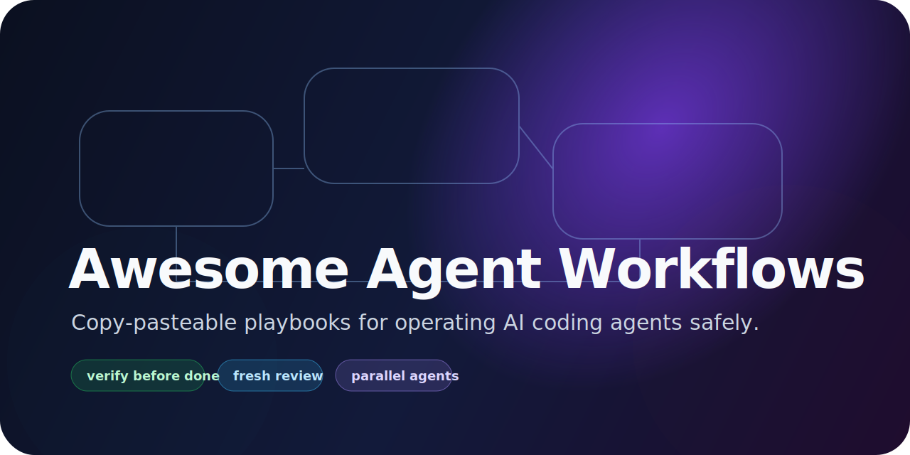
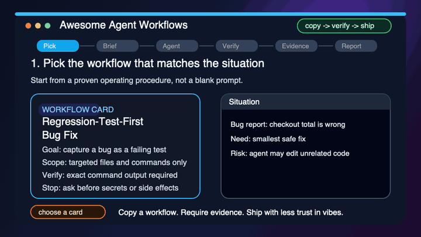

# Awesome Agent Workflows

> Copy-pasteable workflows for shipping real work with AI coding agents, CLI agents, and autonomous development tools.

[](https://awesome.re)
[](LICENSE)



AI agents are powerful, but most examples stop at toy prompts. This repo collects **operational workflows**: how to hand off a task, constrain an agent, verify its work, recover when it drifts, and ship without trusting vibes.

This is not an agent framework. It is not a prompt dump. It is a library of practical operating procedures for people using Claude Code, Codex CLI, Cursor agents, Aider, OpenCode, Gemini-style agents, local agents, LangGraph/CrewAI systems, or custom tool-using assistants.

## Start here by situation

- **I have a vague feature request** → [Spec → Plan → Implementation](workflows/01-spec-to-plan.md)
- **I want to run agents in parallel** → [Parallel Agent Development](workflows/02-parallel-agent-development.md) + [Git Worktree Agent Lanes](workflows/35-git-worktree-agent-lanes.md)
- **The agent says it fixed a bug, but I do not trust it** → [Regression-Test-First Bug Fix](workflows/13-regression-test-first-bugfix.md) + [Fresh-Context Code Review](workflows/04-fresh-context-code-review.md)
- **An agent added tests, but I do not trust the coverage** → [Agent-Generated Test Review](workflows/41-agent-generated-test-review.md)
- **CI failed after an agent change** → [CI Red-to-Green Reproducer](workflows/19-ci-red-to-green.md)
- **Tests are flaky** → [Flaky Test Burn-Down](workflows/20-flaky-test-burndown.md)
- **I am about to merge AI-generated code** → [Agent Patch Intake Triage](workflows/16-patch-intake-triage.md) + [Fresh-Context Code Review](workflows/04-fresh-context-code-review.md)
- **I am changing APIs or schemas** → [API Contract Change Lockstep](workflows/18-api-contract-lockstep.md)
- **I am doing a public release** → [Release Runbook](workflows/07-release-runbook.md) + [Secrets and Config Audit](workflows/38-secrets-config-audit.md)
- **I am launching a public repo** → [Repo Growth Launch](workflows/10-repo-growth-launch.md)
- **A long session is about to compact or hand off** → [Context Compaction and Handoff](workflows/36-context-compaction-handoff.md)

## Quick start

1. Pick the workflow that matches your situation.
2. Copy the **Agent brief** into your agent tool.
3. Fill in the bracketed variables.
4. Run the verification steps before merging, deploying, or reporting success.

```text
Goal: Add a workflow card for fresh-context code review.
Scope: README.md, workflows/, templates/, docs/ only.
Non-goals: Do not change CI, repo settings, secrets, or unrelated files.
Verification: Run python3 scripts/lint_repo.py and report the exact output.
Stop conditions: Ask before publishing, deleting files, or changing repository settings.
```



The demo uses a synthetic public-safe storyboard to show the core loop: choose a workflow, paste a bounded brief into any agent, require verification evidence, then report files changed and remaining risks.

Start with [`templates/agent-brief.md`](templates/agent-brief.md), then browse the full catalog in [`docs/WORKFLOW-CATALOG.md`](docs/WORKFLOW-CATALOG.md).

## Workflow library

The repository now includes **41 workflow cards** across planning, execution, debugging, review, testing, CI, release, security, operations, team process, evaluation, product, and documentation.

A few high-value cards:

- [Change Impact Map](workflows/11-change-impact-map.md) — map blast radius before editing unfamiliar code.
- [Agent Task Contract and Scope Box](workflows/12-agent-task-contract.md) — delegate without drive-by edits.
- [Golden Master Refactor](workflows/15-golden-master-refactor.md) — refactor legacy code safely.
- [Dependency Upgrade Shepherd](workflows/21-dependency-upgrade-shepherd.md) — upgrade libraries with rollback notes.
- [Migration Readiness and Cutover Planner](workflows/25-migration-cutover-planner.md) — stage risky migrations.
- [Workflow Evaluation Harness](workflows/30-workflow-evaluation-harness.md) — evaluate agent workflows before rollout.
- [Prompt and Policy Change Control](workflows/31-prompt-policy-change-control.md) — change prompts and guardrails safely.
- [MCP and Tool Integration Review](workflows/37-mcp-tool-integration-review.md) — review tool permissions and data flow.
- [Secrets and Config Audit](workflows/38-secrets-config-audit.md) — check public-release and CI safety.

For machine-readable metadata, see [`agent-workflows.json`](agent-workflows.json).

## Tool adapters

Use the same workflows with different agents:

- [Claude Code](docs/tools/claude-code.md)
- [Codex CLI](docs/tools/codex-cli.md)
- [Cursor agents](docs/tools/cursor.md)
- [Aider](docs/tools/aider.md)
- [OpenCode](docs/tools/opencode.md)
- [Local/self-hosted agents](docs/tools/local-agents.md)
- [Agent tool comparison matrix](docs/tools/comparison-matrix.md)

## Worked example

See [`examples/fresh-context-review-catches-unverified-pr.md`](examples/fresh-context-review-catches-unverified-pr.md) for an end-to-end example of using a workflow to catch an agent’s unverified completion claim.

## What makes a workflow good?

A good workflow is:

- **portable** — works across tools, not just one vendor;
- **bounded** — says what the agent may and may not touch;
- **observable** — defines evidence before success claims;
- **recoverable** — has stop conditions and rollback steps;
- **short enough to use** — copyable in a real session.

## Contributing

Contributions are welcome. Please add workflows that are practical, tested, and vendor-neutral when possible.

Good contributions include:

- a workflow you have used on a real repo;
- a failure mode and the guardrail that prevented it;
- a reusable agent brief template;
- a launch, QA, review, or debugging checklist;
- a link to a high-quality public resource with a short explanation.

Read [`CONTRIBUTING.md`](CONTRIBUTING.md) and [`docs/curation-policy.md`](docs/curation-policy.md) before opening a PR.

## Public launch plan

The ethical growth plan lives in [`docs/launch/GROWTH-PLAN.md`](docs/launch/GROWTH-PLAN.md). It explicitly avoids paid, fake, or bot engagement. If this repo helps, share it with people building with agents and star it so others can find it.

## License

MIT — see [`LICENSE`](LICENSE).

## Disclaimer

This repository is community-maintained and not affiliated with Anthropic, OpenAI, Cursor, Aider, SST/OpenCode, LangChain, CrewAI, or any other vendor mentioned here.
